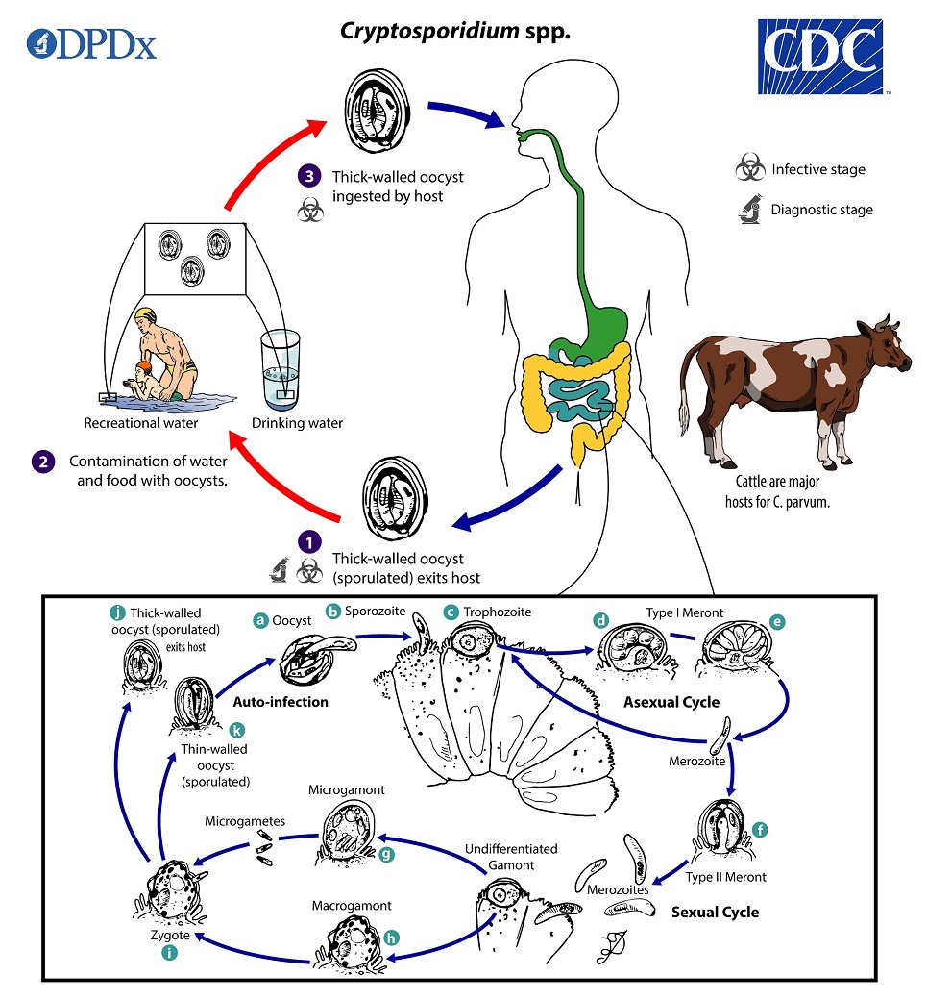
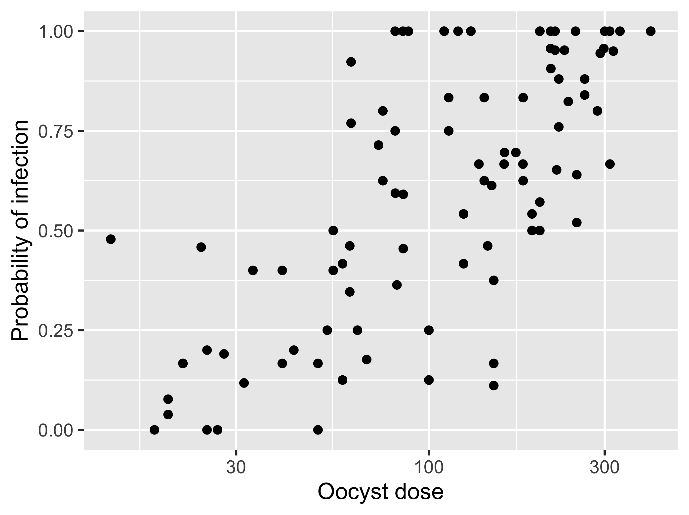
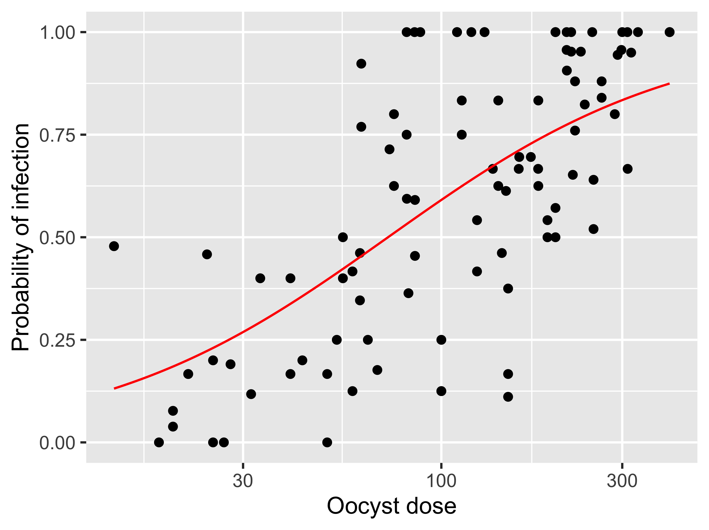
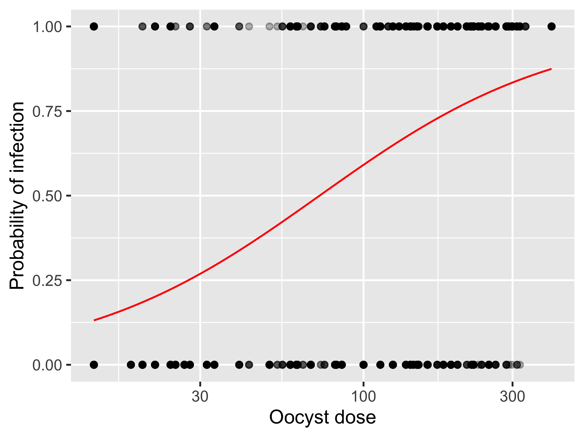
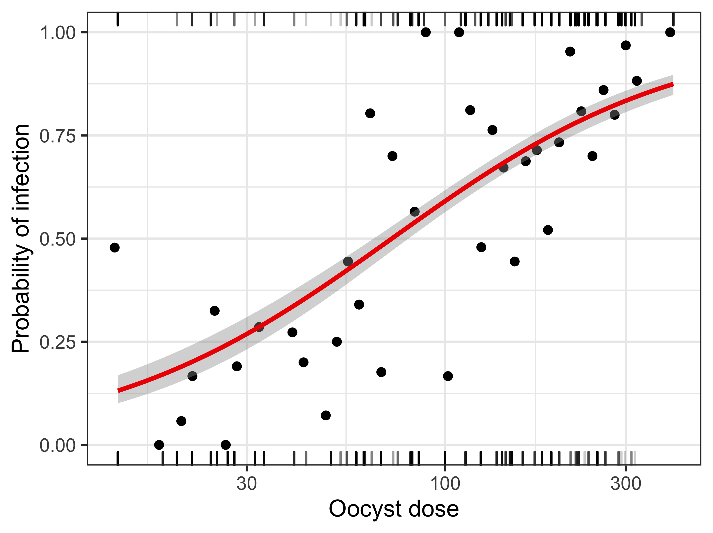
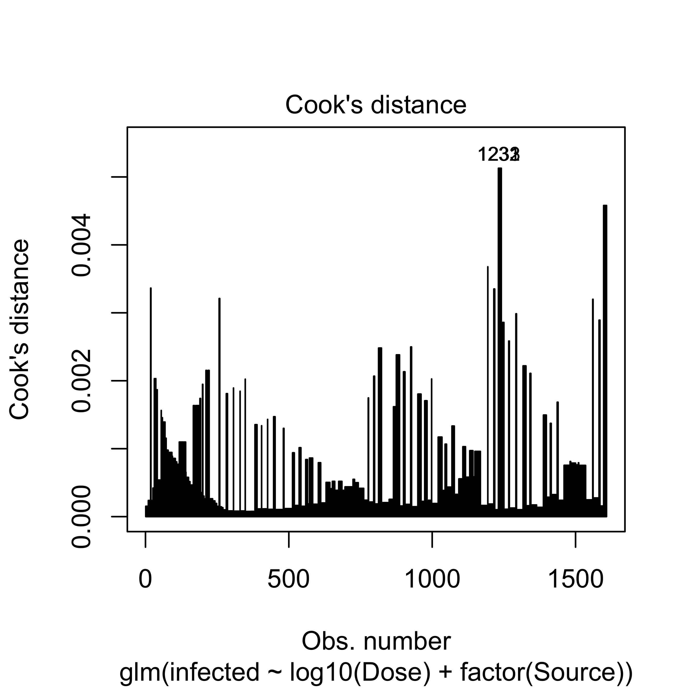
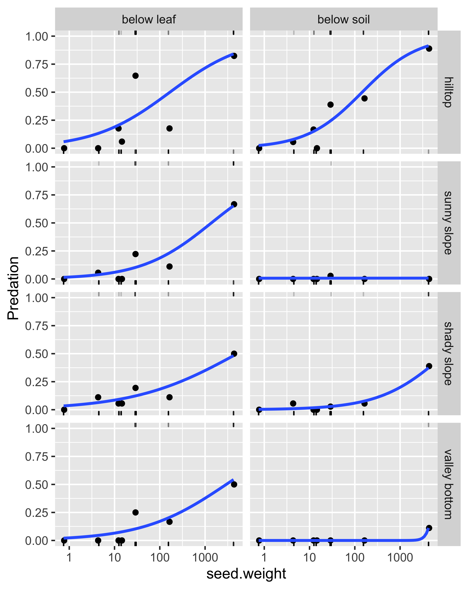
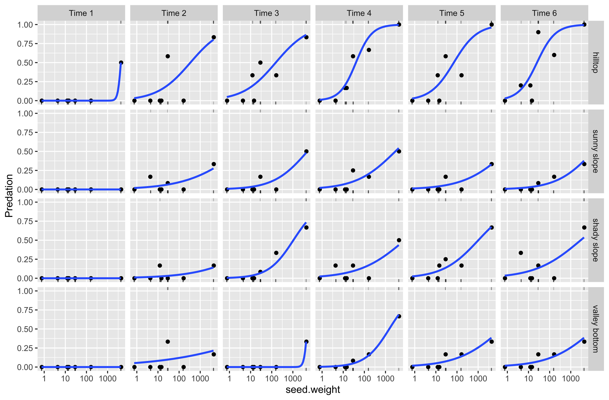

layout: true
  
<div class="my-footer"><span>Qiao-Guo Tan/CEE/XMU | tanqg@xmu.edu.cn | 2025-Apr-24   
&emsp;&emsp;&emsp;&emsp;&emsp;&emsp;&emsp;&emsp;&emsp;&emsp;&emsp;&emsp;&emsp;
&emsp;&emsp;&emsp;&emsp;&emsp;&emsp;&emsp;&emsp;&emsp;&emsp;&emsp;&emsp;&emsp;
</span></div> 


---

## Logistic回归  vs 线性回归  

**线性回归**：响应变量*Y*是连续变量  
$$Y = β_0 + β_1X_1 + β_2X_2 +...+ β_nX_n + ε$$
**Logistic回归**：响应变量*Y*是分类变量（categorical outcome）
* 本次学习binary logistic回归，响应变量*Y*是二分变量，取值只可能是0或者1
 - 例如：生物死亡与否，物种存在与否，患病与否...
 - 若响应变量存在多种取值可能，则进行multinomial (or polychotomous) logistic回归  
 <br>
* Logistic回归不直接预测*Y*的值，而是预测*Y*发生的概率，即*P(Y)*

$$p=P(Y) = \frac{1}{1+e^{-(β_0 + β_1X_1 + β_2X_2 +...+ β_nX_n + ε)}}$$
* 默认阈值是0.5
 - 若*p* > 0.5, *Y* = 1，结果发生
 - 若*p* < 0.5, *Y* = 0，结果未发生
 - 阈值可根据需求自行设定

---
## Logit转换

* **发生比**（odds）：该事件发生和不发生的比率，又称胜算:
$$\frac{p}{1-p}$$

* **逻辑特**（logit）：也称为log-odds，是发生比的自然对数值:
$$\text{logit} = \ln \frac{p}{1-p}$$

* **Logit转换**:

$$\text{logit}=\ln \frac{p}{1-p}= β_0 + β_1X_1 + β_2X_2 +...+ β_nX_n + ε  $$
  - *p*是*Y*发生的概率*P(Y)*，值在0~1之间
  - logit值在 $-\infty$ ~ $\infty$ 之间
  - logit和预测变量 $X_i$ 之间存在线性关系

---
## 数据

**本课件用到两套数据：**  
* 隐胞子虫感染小鼠：`cryptoDATA.csv`  
* 啮齿目动物觅食植物种子：`seedbank.csv`  

数据下载：https://pan.baidu.com/s/1fR4L1D5MVU9Ld_xU4HH__A?pwd=c6bt  

数据来源：Qian S. 2017. Environmental and Ecological Statistics with R. 2nd ed. CRC Press.

---

class: inverse, center, middle  

##  **案例1**  
## 评估饮用水紫外消毒的有效性

---
.pull-left[
## 背景知识  

* 隐胞子虫病（Cryptosporidiosis）是最常见的水源性疾病（waterborne disease）之一，症状是腹泻  

* 病原体（*Cryptosporidium*）在水中以卵囊（oocyst）形式存在，对环境的耐受性高，易于传播  

* 紫外消毒能使卵囊失活，但不一定能将其杀死  

* 将小鼠暴露于特定数量的卵囊，观察小鼠感染与否，评估紫外消毒的有效性
]

.pull-right[
```{r echo=FALSE, out.width=965/2, out.height=1040/2}


```
]

.footnote[图片来源：https://www.cdc.gov/dpdx/cryptosporidiosis/index.html]

 
---
## 了解数据  

```{r message =FALSE}
library(tidyverse)
d <- read.csv("data/cryptoDATA.csv", sep="")
d$Y <- round(d$Y) # 圆整
```
.pull-left67[
```{r}
str(d)
```
]

.pull-right67[

```{r}
head(d)
```

]

* `Dose`：小鼠暴露的隐性孢子虫卵囊（oocyte）数量
* `N`：该处理中，实验小鼠总数
* `Y`：该处理中，受感染小鼠的数量（即总数-感染数）
* `Source`：4项不同研究的代码，即Finch、SPDL-HE、SPDL-TH、UA 


---
## 可视化数据

.pull-left[
```r
d |> 
  mutate(p = (Y/N)) |> 
  ggplot(aes(Dose, p)) +
  geom_point()+
  scale_x_log10()+
  labs(x = "Oocyst dose",
       y = "Probability of infection")
       
ggsave("figs/oocyst_1.png", width = 416/90, height=311/90, dpi=600)
```
]


.pull-right[
```{r echo=FALSE, out.width=416, out.height=311}

```
]

---
## Logistic回归：`glm`函数

```{r}
mod.1 <- glm(cbind(Y, N - Y) ~ log10(Dose), family = binomial(link = "logit"), data = d)
```
* `Y`： 受感染小鼠的数量
* `N - Y`：未受感染小鼠的数量
* `glm`：generalized linear model 广义线性模型  
* `family = binomial(link = "logit")`：响应变量服从二项分布（binomial distribution）
* 二项分布的link function默认是`logit`

可简化为：
```r
glm(cbind(Y, N-Y) ~ log10(Dose), family = binomial(), data = d)
glm(cbind(Y, N-Y) ~ log10(Dose), family = "binomial", data = d)
glm(cbind(Y, N-Y) ~ log10(Dose), family = binomial, data = d)
```
**注意：此处响应变量由两列组成，而更常见的是一列二分变量（两种方式等价，稍后详细介绍）**  
```{r echo=FALSE}
mod.1 <- glm(cbind(Y, N-Y) ~ log10(Dose), family = binomial, data = d)
```

---
输出结果：
```{r highlight.output=c(13)}
summary(mod.1)
```
---
### 结果解读

.center[.red[`logit = −4.8648 + 2.6163 * log10(Dose)`]]
* 截距 $\beta_0$ ：当`log10(Dose) = 0`时，即`oocyst dose = 1`时，`logit = -4.8648`，感染概率是 `1/(1+exp(4.8648)) = 0.00765433`  
<br>  

* 斜率 $\beta_i$ ：`log10(Dose)`增加一个单位（即`Dose`增加一个数量级），`logit`增加`2.6163`
 - 感染概率和剂量之间的关系不是线性的，斜率含义不直观，不易理解
 - $e^{\beta_i}$ 也称为odds ratio，即“比值比”，即 $X_i$ 取值为1和0时的odds之比（注： $\text{odds}=p/(1-p)$ ）

<br>
* `log10(Dose)`是一个显著的预测变量（*p* < 2e-16）

<br>
* 预测感染概率为： $P(\text{Infection}) = \frac{1} {1 + e^{-(−4.8648+2.6163 \text{log}_{10}(Dose))}}$


---
## 结果可视化
.pull-left[
```r
d |> 
  mutate(p = (Y/N)) |> 
  ggplot(aes(Dose, p)) +
  geom_point()+
  scale_x_log10()+
  geom_function(fun = function(x) 1/(1+exp(-(-4.8648+2.6163*log10(x)))), color="red")+
  labs(x = "Oocyst dose",
       y = "Probability of infection")
ggsave("figs/oocyst_2.png", width = 416/90, height=311/90, dpi=600)              
```
]

.pull-right[
```{r echo=FALSE, out.width=416, out.height=311}

```
]

---
### 响应变量转化为二分变量
* 目前响应变量由两列组成，即感染数（`Y`）、未感染数（`N - Y`）
* 可将响应变量转化为二分变量（binary variable）：1表示感染，0表示未感染

```{r}
infected <- NULL
for (i in 1:dim(d)[1]) infected <- c(infected, rep(c(0, 1), c(d$N[i]-d$Y[i], d$Y[i])))
d_long <- data.frame (Dose = rep(d$Dose, d$N), 
                      infected,
                      Source = rep(d$Source, d$N))
```

.pull-left[
```{r}
head(d_long)
```
]

.pull-right[
```{r}
unique(d_long$infected) 
```
 - 响应变量`infected`是二分变量，取值为0或1
]
---
### 响应变量转化为二分变量：做logistic回归，结果一样
```{r}
mod.1a <- glm(infected ~ log10(Dose), data = d_long, family = binomial)
summary(mod.1a)
```

---
## 模型预测的准确率

**预测感染概率：**
```{r }
predicted.p <- predict(mod.1a, type = "response")
```
* 用`predict()`函数计算模型预测值；
* 用选项`type = "response"`直接计算概率值，若不加该选项，计算的是logit值

**预测感染与否：**
```{r }
predicted.infection <- ifelse(predicted.p > 0.5, 1, 0)
```
* 使用默认阈值0.5：*p* > 0.5，则预测感染；*p* < 0.5，则预测不感染


**计算预测准确率：**
```{r }
mean(predicted.infection == d_long$infected)
```
* 预测准确率为`71.5%`


---
## 结果可视化
.pull-left[
```r
d_long |> 
  ggplot(aes(Dose, infected)) +
  geom_point(alpha=0.3)+
  scale_x_log10()+
  geom_function(fun = function(x) 1/(1+exp(-(-4.8648+2.6163*log10(x)))), color="red")+
  labs(x = "Oocyst dose",
       y = "Probability of infection")
       
ggsave("figs/oocyst_3.png", width = 416/90, height=311/90, dpi=600)       
```
]

.pull-right[
```{r echo=FALSE, out.width=416, out.height=311}

```
]

---
## 结果可视化

.pull-left[
```r
d_long |> 
  mutate(rug_b = ifelse(infected == 0, Dose, NA),
         rug_t = ifelse(infected == 1, Dose, NA)) |> 
  ggplot(aes(Dose, infected))+
  theme_bw()+
  geom_rug(aes(x = rug_b), sides = "b", alpha = 0.2) +
  geom_rug(aes(x = rug_t), sides = "t", alpha = 0.2)+
  scale_x_log10()+
  stat_summary_bin(geom = "point", fun = mean, bins = 50) + #bins是分组数，根据情况调整
  geom_smooth(method = "glm", method.args = list(family = "binomial"),
              color = "red2") +
  labs(x = "Oocyst dose",
       y = "Probability of infection")
```
]

.pull-right[
```{r echo=FALSE, out.width=416, out.height=311}

```
]


---
## 增加预测变量`Source`

* 数据来自四项研究（用变量`Source`表示），不同研究之间，模型参数预期有差异

* 两种预期：
 - 相同斜率，不同截距：四条平行线

 - 斜率和截距均各异：四条独立的线

---
### 4项不同研究：相同斜率，不同截距  
```{r highlight.output=c(12,14,15,16)}
mod.2 <- glm(infected ~ log10(Dose) + factor(Source), family = binomial, data = d_long)
summary(mod.2)
```

---
### 4项不同研究：相同斜率，不同截距
* Finch这项研究作为baseline: $\text{logit} = -5.00656 + 2.63312 \text{log}_{10}(Dose)$

<br>
* SPDL-HE研究： $\text{logit} = -5.00656 + 0.04836+ 2.63312 \text{log}_{10}(Dose)$

<br>
* SPDL-TH研究： $\text{logit} = -5.00656 + 0.32151+ 2.63312 \text{log}_{10}(Dose)$

<br>
* UA研究： $\text{logit} = -5.00656 + 0.07143 + 2.63312 \text{log}_{10}(Dose)$

---
#### 小技巧，直接显示各截距

公式中的“-1”使得截距强制为 0，可直接显示各项研究的截距（而不用手动计算）
```{r}
glm(infected ~ log10(Dose) + factor(Source) - 1, family = binomial, data = d_long)
```
等价于：
```r
glm(infected ~ log10(Dose) + factor(Source) + 0, family = binomial, data = d_long)
```
---
### 4项不同研究：斜率和截距均各异，即存在交互作用

```{r}
mod.3 <- glm(infected ~ log10(Dose) * factor(Source), family = binomial, data = d_long)
summary(mod.3)
```

---
### 4项不同研究：斜率和截距均各异，即存在交互作用

* Finch这项研究作为baseline： $\text{logit} = -6.525153 + 3.391808 \text{log}_{10}(Dose)$

<br>
* SPDL-HE研究： $\text{logit} = (-6.525153 + 3.347396) + (3.391808 -1.660155) \text{log}_{10}(Dose)$

<br>
* SPDL-TH研究： $\text{logit} = (-6.525153 + 2.365284) + (3.391808 -1.029288) \text{log}_{10}(Dose)$

<br>
* UA研究： $\text{logit} = (-6.525153 + 0.060014) + (3.391808 -0.008347) \text{log}_{10}(Dose)$

---
#### 小技巧，直接显示各斜率、截距

```{r}
glm(infected ~ log10(Dose) * factor(Source) - 1 - log10(Dose), family = binomial, data = d_long)
```

---
## 常见统计学问题

* 有的文献采用这样的数据分析方法：logit转换后进行线性拟合  


* 存在问题：
 * 当感染比例是0或者1时，logit无法计算，部分数据需被移除（未能充分利用数据）  
 
 * 忽略了数据的二元结构，而使用正态近似，导致对参数不确定性的估计不准确  
 
 * 将感染概率*p*等同于观察到的感染比例，丢失了受试生物总数信息  

---
### 对比logit转化后的线性回归
```{r message =FALSE}
library(car) # 使用logit函数
lm(I(logit(Y/N)) ~ log10(Dose) + factor(Source) , data = d,  subset = Y/N != 0 & Y/N !=1)

```
与`mod.2`对比

---

class: inverse, center, middle  

## 模型的诊断

---
## Logistic回归的前提假设

.large[**1. 线性 Linearity**: logit值与（连续）预测变量之间存在线性关系]  
<br>  

.large[**2. 误差独立 Independence of errors**: 各条数据之间是独立的]  
<br>  

.large[**3. 没有多重共线性 Multicollinearity**: 变量之间的相关性不能很高]  


---
## 判断有无多重共线性
* 预测变量之间存在强相关性，则会导致多重共线性
* 多重共线性会导致模型参数不稳定、不可靠  

**用`car::vif()`函数计算方差扩大因子（Variance Inflation Factor），判断有无多重共线性：**
```{r}
library(car) # install.packages("car")
vif(mod.2)
```
* 如果VIF值大于5（或10），表示存在共线性问题
* 如果存在多重共线性，则需删去有问题的预测变量
* 此处VIF值接近1，说明没有多重共线性问题

???
参考：
When Can You Safely Ignore Multicollinearity?
https://statisticalhorizons.com/multicollinearity/

VIF values and interactions in multiple regression
https://stats.stackexchange.com/questions/52856/vif-values-and-interactions-in-multiple-regression

---
## 检查高影响点

找出库克距离（Cook’s distance）最高的3个数据点 
```r
plot(mod.2, which = 4, id.n = 3)
```
```{r echo=FALSE, out.width=400, out.height=400}

```

---

class: inverse, center, middle  

## 案例2
## 啮齿目动物觅食植物种子


---
## 实验设计
* 采集了8个常见树种的种子  
<br>
* 种子置于小纱布袋中，放置在4种地形位置（.red[**`topo`**]）
 - 山顶、阳坡、阴坡和谷底  
<br>
* 在每个实验地点，设置两个埋藏深度（.red[**`ground`**]）：
 - 落叶层下、4厘米土层下，每种种子各放6袋
 - 这种模式在每个地方重复3次，种子袋平均间距1米  
<br>
* 每隔1个月检查1次，共6次（.red[**`time`**]）
 - 2005年1月到11月
 - 每次检查6袋中的1袋，查看种子是完好无损或被吃掉  
<br>
* 除了田间变量外，测量种子平均重量（.red[**`seed.weight`**]）

---
## 提出科学问题
* **1. 对不同植物种子的偏好**：whether rodents are selective on seeds  
<br>

* **2. 对种子新鲜程度的偏好**：whether rodents prefer new seeds over leftover seeds from previous years  
<br>

* **3. 是否只吃地表的种子**：do rodents only search for seeds on the surface  
<br>

* **4. 对地形的偏好**：whether rodents are selective in where to forage (the role of topography)  

---
## 读取数据

```{r}
d_seed0 <- read.csv("data/seedbank.csv", na = "-") 
d_seed <- na.omit(d_seed0) #删去缺失值
head(d_seed)
```
.footnote[数据来源：Qian S. 2017. Environmental and Ecological Statistics with R. 2nd ed. CRC Press.]

---
## 预处理数据  

将数值变量转为因子：
```{r}
d_seed$time <- factor(d_seed$time, labels=c("Time 1", "Time 2", "Time 3", "Time 4","Time 5", "Time 6")) 
d_seed$topo <- factor(d_seed$topo, labels =c("hilltop", "sunny slope", "shady slope", 
"valley bottom"))
d_seed$ground <- factor(d_seed$ground, labels = c("below leaf", "below soil"))
str(d_seed)
```

---
## Logistic回归分析  

```{r}
mod.seed.1 <- glm(Predation ~ time + topo + ground + log(seed.weight), family = binomial, data = d_seed)
```
若不考虑交互作用，所做回归等价于以连续变量`log(seed.weight)`为预测变量，在不同`time`，`topo`，`ground`组合中，各自拟合一条线，这些线斜率相同，截距不同。

---
**输出结果：**
```{r}
summary(mod.seed.1)
```

---
.pull-left[
## 可视化  

对比各“地形 * 埋藏深度”组合

```r 
d_seed |> 
  mutate(survived = ifelse(Predation == 0, seed.weight, NA),
         eaten    = ifelse(Predation == 1, seed.weight, NA)) |> 
  ggplot(aes(seed.weight, Predation))+
  geom_rug(aes(x = eaten), sides = "t", alpha = 0.2) +
  geom_rug(aes(x = survived), sides = "b", alpha = 0.2)+
  scale_x_log10()+
  facet_grid(topo~ground)+
  stat_summary_bin(geom = "point", fun = mean, bins = 50) +
  geom_smooth(method = "glm", method.args = list(family = "binomial"), se = FALSE) 
```


```{r echo=F, eval=FALSE}
ggsave("figs/seed_1.png", width = 430/90, height=540/90, dpi=600)
```
]

.pull-right[

```{r echo=FALSE, out.width=430, out.height=540}

```
]

---

## 可视化  
对比各"地形 * 时间"组合

```r 
d_seed |> 
  mutate(survived = ifelse(Predation == 0, seed.weight, NA),
         eaten    = ifelse(Predation == 1, seed.weight, NA)) |> 
  ggplot(aes(seed.weight, Predation))+
  geom_rug(aes(x = eaten), sides = "t", alpha = 0.2) +
  geom_rug(aes(x = survived), sides = "b", alpha = 0.2)+
  scale_x_log10()+
  facet_grid(topo~time)+
  stat_summary_bin(geom = "point", fun = mean, bins = 50) +
  geom_smooth(method = "glm", method.args = list(family = "binomial"), se = FALSE) 

```

```{r echo=F, eval=FALSE}
ggsave("figs/seed_2.png", width = 820/90, height=540/90, dpi=600)
```

---
## 可视化  
对比各"地形 * 时间"组合  

```{r echo=FALSE, out.width=820/1.2, out.height=540/1.2}

```

???
参考：Three ways to plot logistic regressions
https://www.ericrscott.com/post/plot-logistic-regressions/

---
### 结论
* 喜欢吃大种子：Rodents in this part of China favor large seeds  
<br>

* 喜欢在山顶和阳坡觅食：They tend to forage more often in hilltops and sunny slopes than other locations  
<br>

* 喜欢吃新鲜的：They favor new seeds  
<br>

* 在山顶觅食时，对大种子的偏好更明显：When foraging on hilltops, their preference for large seeds is more obvious  
<br>

* 如无必要，不挖土觅食：They don’t like to dig around if not necessary  

---

class: inverse, center, middle  

## 附：基础概念  


---
.pull-left[
## 基础概念  

**log-likelihood：**  

$$\text{log-likelihood} = \sum_{i=1}^{n}[Y_i\cdot\ln(P(Y_i))+(1-Y_i)\cdot\ln(1-P(Y_i))]$$

* 衡量拟合的优劣，和线性回归中的RSS类似
* 是一个负值，越接近0，表明拟合越好

<br> 

**离差：**  

$$\text{deviance} = −2\times\text{log-likelihood} = -2LL$$
]

.pull-right[

**likelihood ratio符合卡方分布（ chi-square distribution）：**
$$\chi^2=-2LL(\text{baseline})-(-2LL(\text{new}))$$  

$$df=k_\text{new}-k_\text{baseline}$$
* $df$ ：自由度
* $k_\text{baseline}$ : 基准模型的参数个数, 为1
* $k_\text{new}$ ：新模型中的参数个数

<br> 

$$\text{AIC} = -2LL+2k$$
* $k$ ：模型中的预测变量个数

<br> 

$$\text{BIC} = -2LL+2k\times log(n)$$
* $n$ ：模型中的样本数
]


---
### 要点小结

* Logistic回归：
 - 无交互作用： `glm(y ~ x1 + x2..., famliy = binomial, data = d)`  
 - 有交互作用： `glm(y ~ x1 * x2..., famliy = binomial, data = d)`  
<br>

* 发生比（odds）:  $p/(1-p)$  
<br>

* 逻辑特（logit）:  $\ln(p/(1-p)) = \ln(\text{odds})$

<br>

* 比值比（odds ratio）： $e^{\beta_i}$

<br>

* 发生概率： $p = \frac{1}{1+e^{-(β_0 + β_1X_1 + β_2X_2 +...+ β_nX_n )}}$

---

## 参考文献：

.large[Qian S. 2017. Environmental and Ecological Statistics with R. 2nd ed. CRC Press. Chapter 8 Generalized Linear Model.]

.large[Field A., Miles J., Field Z. 2012. Discovering Statistics Using R. SAGE Publications Ltd. Chapter 8 Logistic Regression.]

<br>

### 推荐阅读：
* Roback, P., & Legler, J. 2021. Beyond Multiple Linear Regression: Applied Generalized Linear Models and Multilevel Models in R. CRC Press. Chapter 6 Logistic Regression. https://bookdown.org/roback/bookdown-BeyondMLR/ch-logreg.html


* Logistic Regression Essentials in R. 
http://www.sthda.com/english/articles/36-classification-methods-essentials/151-logistic-regression-essentials-in-r

* Logistic Regression Assumptions and Diagnostics in R. 
http://www.sthda.com/english/articles/36-classification-methods-essentials/148-logistic-regression-assumptions-and-diagnostics-in-r
